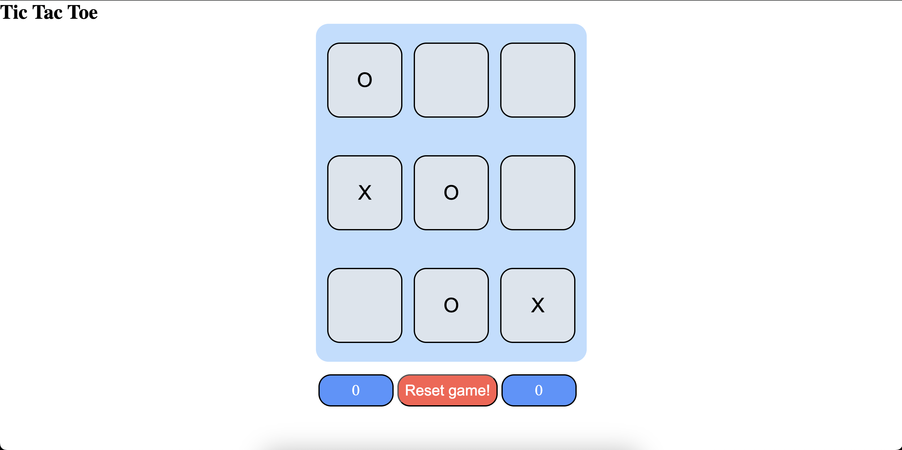
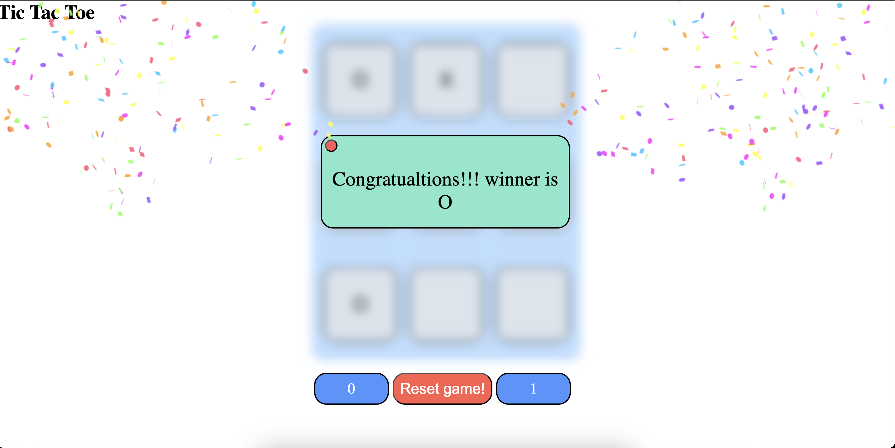

# 🎮 Tic-Tac-Toe Game  

A classic Tic-Tac-Toe game built using HTML, CSS, and JavaScript. Challenge a friend or play solo to enjoy this timeless game!

---

## 🌟 Features  

- 👥 **Two-Player Mode**: Play with a friend on the same device.  
- 🧠 **Simple Logic**: Easy-to-understand gameplay with basic rules.  
- 🎨 **Responsive Design**: Works seamlessly on desktop and mobile devices.  
- ✨ **Visual Feedback**: Highlights the winning line and provides a clean interface.  

---

## 🛠️ Technologies Used  

- **HTML**: To structure the game board.  
- **CSS**: For styling and visual appeal.  
- **JavaScript**: To implement game logic and interactivity.  

---

## 🚀 How to Play  

1. Clone or download this repository.  
2. Open the `index.html` file in your browser.  
3. Take turns marking X or O on the board.  
4. The first player to align three marks in a row, column, or diagonal wins!  

---
## 🏞️ Screenshots

**screenshot-1**

**screenshot-2**

---
## 📧 Contact  

For questions or feedback, feel free to reach out:  
**Ashish More** - [GitHub Profile](https://github.com/ashish-more-02)  

---

## ⭐ Acknowledgments  

Inspired by the classic game of Tic-Tac-Toe .
